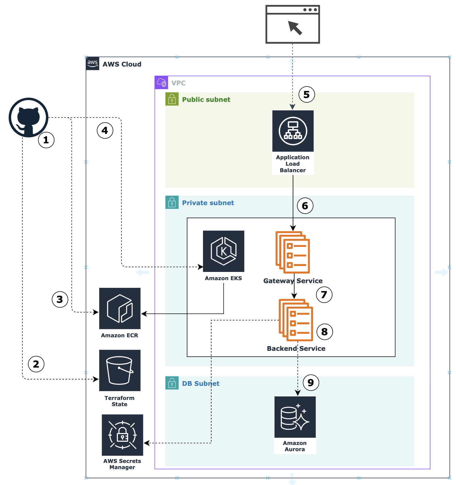
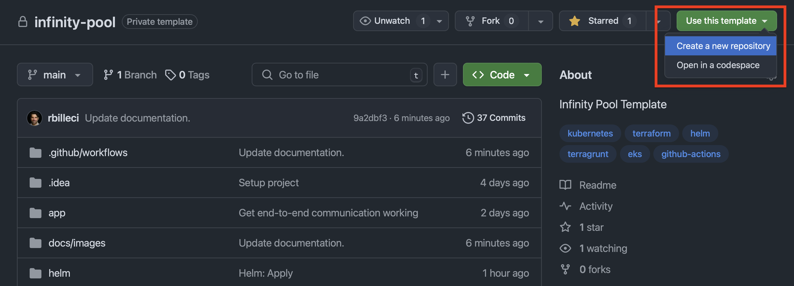
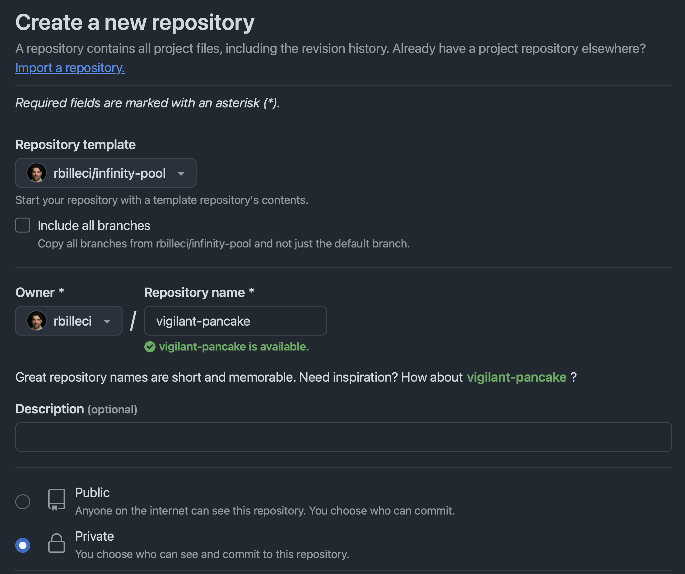
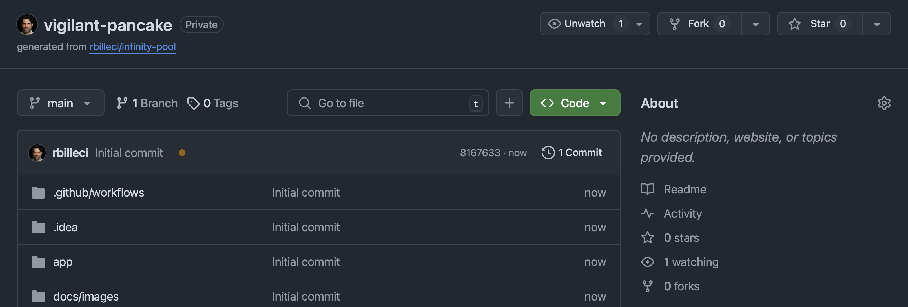
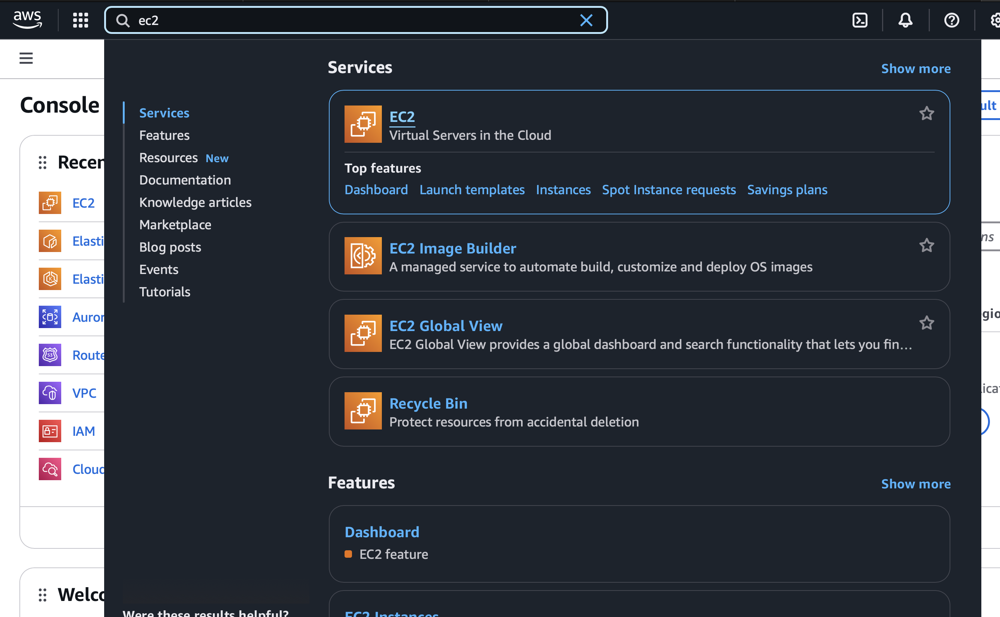
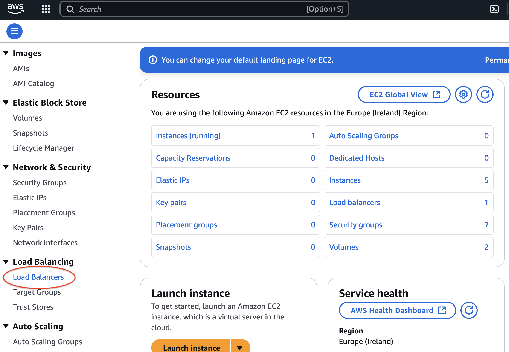
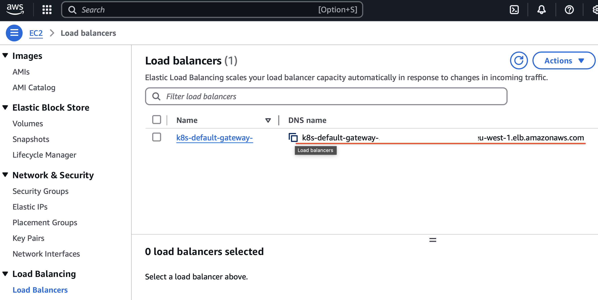

# Infinity Pool Sample Project


The Infinity Pool sample project demonstrates how to use container orchestration and 
Infrastructure-as-Code (IaC) technologies to build, deploy, run, and scale infrastructure and services on 
Amazon Web Services (AWS). Originally developed as part of an interview exercise, this project has been 
made public in the hope that it will benefit others. While the project is fully functional, 
there is room for improvement and optimization—contributions are welcome!

Infinity Pool is provided as a GitHub template, making it easy to create a new project from the template and 
customize it to your needs.

Let's start by looking at the solution architecture for Infinity Pool.

## Solution Architecture

#### Technologies Used

The Infinity Pool infrastructure and services are built on the following technologies:

- AWS as the cloud provider.
- EKS Auto Mode for container orchestration, with AWS ECR for container images.
- Amazon Aurora Serverless for PostgreSQL as the database engine.
- AWS Secrets Manager for secure storage of database credentials.

#### Infinity Pool Services Overview
Infinity Pool consists of two simple microservices:
* Gateway Service: Receives requests through an Application Load Balancer.  Forwards the requests to the Backend Service.
* Backend Service: Processes requests received from the Gateway. Queries with the postgres database to retrieve 
  "hello world" messages, returning them to the Gateway Service.

#### CI/CD Architecture

Infinity Pool uses a modern CI/CD and Infrastructure-as-Code (IaC) approach that includes:

- Terragrunt: For managing Terraform configurations.
- Terraform: For provisioning infrastructure, with Amazon S3 used for state management.
- Helm: For deploying the Gateway Service and Backend Service to EKS.
- GitHub Actions: For continuous integration and delivery, with act available for local workflow testing.

#### Deployment Architecture




1. **GitHub:** on commit a workflow is triggered. GitHub runners use Terragrunt, Terraform, and Helm to deploy the infrastructure. 
2. **Terraform State:** is stored in Amazon S3
3. **GitHub Actions:** build the Gateway Service and Backend Service images and push them to Amazon ECR.
4. **Helm** is triggered by GitHub Actions to run the Gateway Services and Backend Services, and configure ingress.
5. **Requests** from external sources are routed through Amazon Load Balancers.
6. **Gateway Service:** receives requests 
7. The **Gateway Service** forwards requests to the Backend Service.
8. The **Backend Service** handles requests from the Gateway Service. It gets database credentials from the AWS Secrets Manager.
9. The **Backend Servuce** queries a Postgres database to fetch a "hello world" message. This message is passed back to 
   the **GatewayService**, through the ALB, and back to the requester.


<div style="clear:right"></div>

#### Network Topology

The Infinity Pool application follows best practices for running highly reliable and fault tolerant serivces in the cloud:
1. The VPC is configured with public, private, and database subnets.
    - The *public subnets* contain only the Application Load Balancers and NAT Gateways.
    - The *private subnets* contain EKS nodes for the Gateway Services and Backend Services.
    - The *database subnets* contain the Aurora Serverless clusters
2. All resources are configured to run across 3 availability zones. 
   Note: for cost savings, the AWS NAT Gateway is configued in a single AZ. To run this in production, you should change
   the VPC module configuration in the `terraform` configuration. 

#### Project Structure

```

  ├── .env                     # Environment variables for act
  ├── .github                  # GitHub configuration
  │   └── workflows/           # CI/CD Workflows for deploying and destroying Infinity Pool
  ├── README.md                # Overview and project documentation.
  ├── app/                     # Infinity Pool services
  │   ├── backend/             # Backend Service, python and docker files
  │   └── gateway/             # Gateway Service, python and docker files
  ├── docs/                    # README.md resources (images)
  ├── helm/                    # Helm chart for deploying gateway and backend service
  └── infrastructure/          # Infrastructure-as-Code
      ├── live/                # Terragrunt Live Configuration
      └── modules/             # Terraform Modules
```


## Deployment of the Infinity Pool sample application
#### Prerequisites
To run the Infinity Pool application, you will require the following:

* An **AWS Account:** the Infinity Pool sample application is built on AWS. You need access to an account.
* **AWS Experience:** basic experience with AWS is required. 
    You need familiarity with IAM and EC2, and must know how to create an access key.
* **GitHub Account:** Infinity Pool uses GitHub actions for deployment, so you need a GitHub account. 
    You will be guided on how to create a new project from this template, setup your AWS secrets, and them trigger 
    the CI/CD process to deploy Infinity Pool to your account.

#### Known Limitations

* The current version of this application limits to **one deployment per AWS account**. 
* The current version has been tested only in the `eu-west-1` region.


#### Step 1: Create a new repository from the template
In the Infinity Pool GitHub project, select `Use this template` in the top right of the home page.
Then, select `Create a new repository`.
<br/><div style="text-align: center;"></div><br/>

Enter a repository name and select if you want the repository to be public or private. 
Then select `Create repository`.
In this example, we named the repository `vigilant-pancake`.
You can name your repository how you want.

<br/><div style="text-align: center;"></div><br/>

After a few seconds, your new repository will be created from the Infinity Pool template. 

<br/><div style="text-align: center;"></div><br/>

#### Step 2: Create an AWS User and Generate an Access Key

To enable GitHub Actions to deploy the Infinity Pool sample application to AWS, you need an AWS user with 
the appropriate permissions an access key. If you don't already have credentials, you can follow these steps
to create a new user and access key:

1. Sign in to AWS IAM
   - Go to AWS IAM Console.  
   - Ensure you're logged in as an AWS account administrator or a user with permission to create IAM users and 
     manage permissions.
2. Create a New IAM User
   - From the IAM dashboard, click `Users` in the left navigation pane. 
   - Click `Create user`. 
   - Enter a username (e.g., infinity-pool). 
   - **IMPORTANT** do not give the user access to the AWS Management Console 
   - Click `Next`
3. Assign Permissions to the User
   - Select `Attach policies directly`.
    - In the search bar, type `AdministratorAccess` and select the checkbox next to the policy named AdministratorAccess. 
     **Note: For a real-world application, you should adhere to the principle of least privilege by providing only 
    the minimum required permissions. However, for simplicity in this exercise, AdministratorAccess is sufficient.**
   - Click `Next` 
4. Review and Create the User 
   - Review the details to ensure correctness. 
   - Click `Create user`.
5. Create the Access Key
   - After the user is created, select it from the list of users.
   - In the top right, select `Create access key`
   - You'll be prompted to select your use case.
   - Select `Other` then select `Next`
   - Select `Create access key`
   - Select `Show`, then record in a secure location the values for the `Access Key` and `Secret Access Key`. 
     You can also choose to download the values as a CSV.` **IMPORTANT: This is the only time AWS will show you the Secret Access Key. 
     Ensure you securely copy and store these credentials, as you'll need them shortly.**
   - Select `Done`


#### Step 3: Configuring Secrets and Variables for GitHub Actions

In this step, you'll set up GitHub Secrets and variables that GitHub Actions will use to 
securely deploy the Infinity Pool application to your AWS account. For information on how to configure secrets in GitHub Actions [here.](https://docs.github.com/en/actions/security-for-github-actions/security-guides/using-secrets-in-github-actions)

First, configure your secrets:
1. Navigate to GitHub Repository Settings
    - Go to your newly created GitHub repository that was copied from the Infinity Pool template. 
    - Click on the "Settings" tab at the top-right corner of your repository.
    - In the left sidebar, select `Secrets and variables`, then choose `Actions`. 
2. Set GitHub Secrets `AWS_ACCESS_KEY_ID` and `AWS_SECRET_ACCESS_KEY`. 
GitHub Secrets securely store sensitive information like AWS credentials.
Follow these steps to add your AWS credentials:
   - Under `Secrets`, click the `New repository secret` button.
   Add the following two secrets separately: `AWS_ACCESS_KEY_ID` and `AWS_SECRET_ACCESS_KEY`. 
   The values should come from the AWS Access Key you prviously created.

You'll also need to set the `AWS_REGION` we'll deploy the Infinity Pool application to. 
The AWS region will be configured as a GitHub Variable. 
Unlike secrets, GitHub variables store non-sensitive configuration information.

1. You should still be in the`Secrets and variables`  `Actions` page. 
    - Select the `Variables` tab. 
    - Click `New repository variable`
    - enter `AWS_REGION` as the name, and `eu-west-1` as the value.


#### Step 4: Deploying the Infinity Pool application

Assuming you've configured secrets for `AWS_ACCESS_KEY_ID` and `AWS_SECRET_ACCESS_KEY`,
and the `AWS_REGION` variable, you are ready to deploy the Infinity Pool application.
You can manyally trigger the deployment in GitHub Actions.

1. Select the `Actions` tab in your project.
2. In the left sidebar, you'll see the list of workflows. Select `Infinity Pool CI/CD`.
3. Select the `Run workflow` dropdown, then select `Run workflow`
4. Refresh the page and you should see the workflow running.
5. Wait until the workflow finishes execution before continuing. Deploying the Infinity Pool sample application can take between 15-30 minutes, 
due to provisioning of the EKS cluster, Aurora Serverless database cluster, and Application Load Balancers.


#### Validating the Application is running

To validate the application is running, you can connect to the gateway service via the provisioned 
Application Load Balancer (ALB). To get the DNS name of the load balancer, you can either retrieve it from
the AWS Console or get it from the command line.

##### Getting the DNS Name from AWS Console

1. Login to the AWS Console, search for "ec2", then navigate to the EC2 page

    <br/><div style="text-align: center;"></div><br/>

2. In the sidebar, select "Load Balancers"

   <br/><div style="text-align: center;"></div><br/>

3. You will then see a list of the load balancers. Find the load balancer a name starting with `k8s-default-gateway`. 
   This is the load balancer to the gateway service. You can copy its DNS name and paste it into your web browser.
   
    <br/><div style="text-align: center;"></div><br/>

##### Alternative: Getting the DNS Name from the Command Line

If your local computer is already configure with the AWS CLI and kubectl, this approach might be easier for you.
If you don't have these tools installed, it is recommended to get the DNS name from the AWS Console.

You'll need to have installed the AWS CLI and `kubectl`.  
Also make sure to have run `aws configure` so that your credentials are properly setup. 

Then, run the following commands:

    aws eks update-kubeconfig --region eu-west-1 --name eks-infinity-pool-dev
    kubectl get ingress gateway -n default -o jsonpath='{.status.loadBalancer.ingress[0].hostname}' && echo

You should get an similar to: `k8s-default-gateway-aaaaaaaaaa-1111111111.eu-west-1.elb.amazonaws.com`.
Enter this into you web browser, and you should see a hello world message like:

    {"data":{"greeting":"Hello World"},"message":"Response from infinity-pool database"}


#### Destroying the Environment

To uninstall the Infinity Pool sample application, navigate to your GitHub project and select the 'Actions' tab.
On the left sidebar you'll see a workflow titled 'Destroy the Infinity Pool Application'. Select that workflow, then 
select the button 'Run workflow' as shown in the screenshot:

Expect it to take 15-30 minutes for the infrastructure to be destroyed.

<br/><div style="text-align: center;"></div><br/>


## Testing CI/CD Locally

You can test the CI/CD pipeline locally by installing [Act](https://nektosact.com/introduction.html). 

- You'll need to create a `.secrets` file in the project directory. The `.secrets` file is in the `.gitignore` and
should not be checked-in, since it contains the AWS_ACCESS_KEY_ID and AWS_SECRET_ACCESS_KEY.
- There is also a `.env` file that references the AWS_REGION environment variable. This is needed for pushing images to
  the AWS ECR Repository.


## References

1. [GitHub Actions Tutorial](https://www.youtube.com/watch?v=YLtlz88zrLg) 
2. [Act](https://nektosact.com/introduction.html), for testing GitHub Actions locally. 
