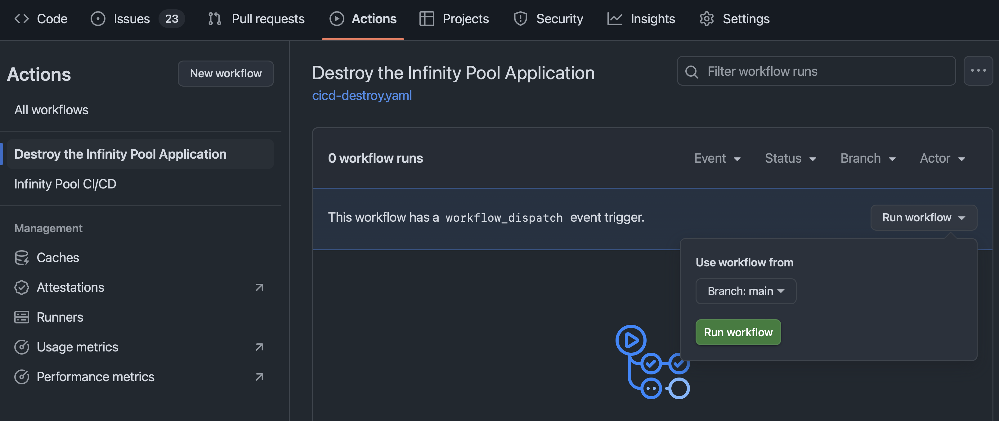

# Infinity Pool Sample Application

## Introduction

This is a guide to setting up the Infinity Pool sample application.

## Solution Architecture

<< PLACEHOLDER >>

## Project Layout

<< INFORMATION ON FILES IN PROJECT >>

## Prerequisites
To run the Infinity Pool application, you will require the following:

1. **AWS Account:** since the Infinity Pool sample application is built on AWS, an account with AWS is required. 
2. **GitHub Account:** This project is delivered as a template, using GitHub Actions to build and deploy to AWS.    

## Limitations

* The current version of this application limits to **one deployment per AWS account**. 
* The current version has been tested only in the `eu-west-1` region.

## Deploying the Infinity Pool Application

### Step 1: Create a new repository from the template
In the Infinity Pool GitHub project, select `Use this template` in the top right of the home page.
Then, select `Create a new repository`.
 

 

Enter a repository name and select if you want the repository to be public or private. 
Then select `Create repository`.

 

 

After a few seconds, your new repository will be created from the Infinity Pool template. 
In this example, we named the repository `vigilant-pancake`. 
You can name you repository how you want.

 

 

### Get an AWS Account

A prerequisite to deploying the Infinity Pool application is to have an AWS Account. 
The application is deployed to the eu-west-1 region by default.
You will need to create an ACCESS KEY and SECRET ACCESS KEY.  These will be configured as secrets for GitHub Actions. 

### Configuring secrets for GitHub Actions

Configure the following GitHub Secrets. These are required to deploy the infinity pool application to your AWS account. 
For information on how to configure secrets in GitHub Actions [here.](https://docs.github.com/en/actions/security-for-github-actions/security-guides/using-secrets-in-github-actions)

    AWS_ACCESS_KEY_ID
    AWS_SECRET_ACCESS_KEY

You also need to set the AWS_REGION as a GitHub variable (not a secret)
    
    AWS_REGION=eu-west-1

### Monitoring Progress of Deployment

Deploying the Infinity Pool sample application can take between 15-30 minutes, 
due to provisioning of the EKS cluster, Aurora Serverless database cluster, and Application Load Balancers.

<< PLACEHOLDER: Describe how to view job in GitHub >>

### Validating the Application is running

To validate the application is running, you can connect to the gateway service via the provisioned 
Application Load Balancer (ALB). To get the DNS name of the load balancer, you can either retrieve it from
the AWS Console or get it from the command line.

#### Getting the DNS Name from AWS Console

1. Login to the AWS Console, search for "ec2", then navigate to the EC2 page

      

  

2. In the sidebar, select "Load Balancers"

     

  

3. You will then see a list of the load balancers. Find the load balancer a name starting with `k8s-default-gateway`. 
   This is the load balancer to the gateway service. You can copy its DNS name and paste it into your web browser.
     

  

#### Alternative: Getting the DNS Name from the Command Line

If your local computer is already configure with the AWS CLI and kubectl, this approach might be easier for you.
If you don't have these tools installed, it is recommended to get the DNS name from the AWS Console.

You'll need to have installed the AWS CLI and `kubectl`.  
Also make sure to have run `aws configure` so that your credentials are properly setup. 

Then, run the following commands:

    aws eks update-kubeconfig --region eu-west-1 --name infinity-pool-eks
    kubectl get ingress gateway -n default -o jsonpath='{.status.loadBalancer.ingress[0].hostname}' && echo

You should get an similar to: `k8s-default-gateway-aaaaaaaaaa-1111111111.eu-west-1.elb.amazonaws.com`.
Enter this into you web browser, and you should see a hello world message like:

    {"data":{"greeting":"Hello World"},"message":"Response from infinity-pool database"}

### Destroying the Environment

To uninstall the Infinity Pool sample application, navigate to your GitHub project and select the 'Actions' tab.
On the left sidebar you'll see a workflow titled 'Destroy the Infinity Pool Application'. Select that workflow, then 
select the button 'Run workflow' as shown in the screenshot:

Expect it to take 15-30 minutes for the infrastructure to be destroyed.

# Testing CI/CD Locally

You can test the CI/CD pipeline locally by installing [Act](https://nektosact.com/introduction.html). 

- You'll need to create a `.secrets` file in the project directory. The `.secrets` file is in the `.gitignore` and
should not be checked-in, since it contains the AWS_ACCESS_KEY_ID and AWS_SECRET_ACCESS_KEY.
- There is also a `.env` file that references the AWS_REGION environment variable. This is needed for pushing images to
  the AWS ECR Repository.

  
# References

1. [GitHub Actions Tutorial](https://www.youtube.com/watch?v=YLtlz88zrLg) 
2. [Act](https://nektosact.com/introduction.html), for testing GitHub Actions locally. 